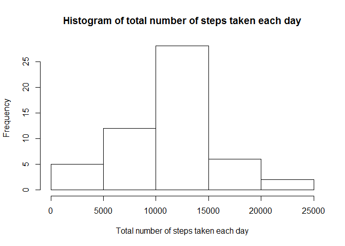
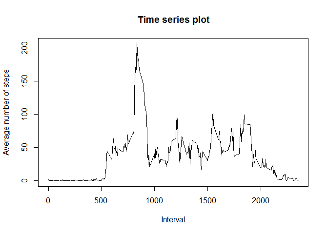
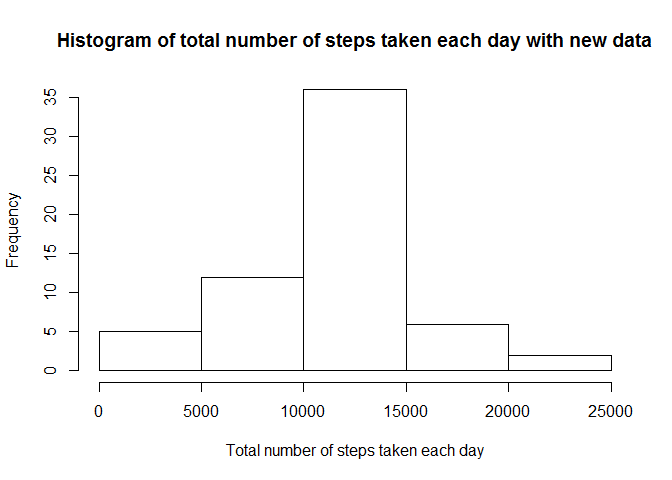
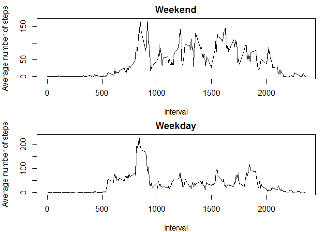

# Reproducible Research: Peer Assessment 1


## Loading and preprocessing the data
The libraries used in this project are loaded. 

```r
library(dplyr)
```

```
## 
## Attaching package: 'dplyr'
```

```
## The following objects are masked from 'package:stats':
## 
##     filter, lag
```

```
## The following objects are masked from 'package:base':
## 
##     intersect, setdiff, setequal, union
```

```r
library(lubridate)
```

```
## Warning: package 'lubridate' was built under R version 3.4.1
```

```
## 
## Attaching package: 'lubridate'
```

```
## The following object is masked from 'package:base':
## 
##     date
```
The data file is unzipped and loaded. The date column in the data file is read as "Date".

```r
unzip("activity.zip")
activity <- read.csv("activity.csv") 
activity$date <- ymd(activity$date)
```

## What is mean total number of steps taken per day?
By ignoring the missing values in the dataset, the total number of steps taken per day is calculated and plotted in the histogram below. 

```r
totsteps <- group_by(activity, date) %>%
            filter(!is.na(steps)) %>%
            summarise(tot=sum(steps, na.rm=TRUE))
hist(totsteps$tot, 
     xlab="Total number of steps taken each day",
     ylab="Frequency",
     main="Histogram of total number of steps taken each day")
```

<!-- -->

```r
totstepsmean <- summarise(totsteps,mean=mean(tot, na.rm=TRUE))
totstepsmedian <- summarise(totsteps,median=median(tot, na.rm=TRUE))
```
The total mean and median of the total number of steps taken per day is 10766.19 and 10765 respectively. 


## What is the average daily activity pattern?
The time series plot of the 5-minute interval and the average number of steps taken, averaged across all days is shown below.

```r
totstepstime <- group_by(activity, interval) %>%
                filter(!is.na(steps)) %>%
                summarise(average=mean(steps, na.rm=TRUE))
plot(totstepstime$interval, totstepstime$average,type="l",
     xlab="Interval",ylab="Average number of steps",
     main="Time series plot")
```

<!-- -->

```r
maxstep <- arrange(totstepstime, desc(average))
max <- maxstep[1,1]
```
The 5-minute interval, on average across all the days in the dataset, which contains the maximum number of steps is 835. 


## Imputing missing values


```r
missingvalues <- sum(is.na(activity$steps))
```
The total number of missing values in the dataset is 2304.

Using the mean for the 5-minute interval to fill in the missing values, a new dataset with the missing data filled in is created. 

```r
intervalmean <- group_by(activity, interval) %>%
                filter(!is.na(steps)) %>%
                summarise(mean=mean(steps, na.rm=TRUE))
activity_filled <- activity
for(i in 1:nrow(activity_filled)){
        if(is.na(activity_filled$steps[i])){
                interval_val <- activity_filled$interval[i]
                steps_val <- intervalmean[intervalmean$interval==interval_val,]
           activity_filled$steps[i] <- steps_val$mean
        }
}
```
A histogram of the total number of steps taken each day of this new dataset is shown below.

```r
totsteps_new <- group_by(activity_filled, date) %>%
                summarise(tot=sum(steps))
hist(totsteps_new$tot, 
     xlab="Total number of steps taken each day",
     ylab="Frequency",
     main="Histogram of total number of steps taken each day with new data")
```

<!-- -->

```r
totstepsmean_new <- summarise(totsteps_new, mean=mean(tot, na.rm=TRUE))
totstepsmedian_new  <-summarise(totsteps_new, median=median(tot, na.rm=TRUE)) 
```
The mean and median total number of steps taken per day is 10766.19 and 10766.19 respectively. 

There is no change in the mean value but the median has increased. In fact, after using the mean for the 5-minute interval to fill in the missing values, the median value is now the same as that of the mean value. 

## Are there differences in activity patterns between weekdays and weekends?
Using the dataset with the filled-in missing values, a new factor variable is created with two levels - "weekday" and "weekend".

```r
activity_new <- activity_filled
activity_new$day <- weekdays(activity_filled$date)
for(i in 1:nrow(activity_new)){
        if(activity_new$day[i] %in% c("Saturday","Sunday")){
                activity_new$daytype[i] <- "weekend"
        } 
        else {
                activity_new$daytype[i] <- "weekday"
        }
}
activity_new$daytype <- as.factor(activity_new$daytype)
```
A panel plot is shown below, showing a time series plot of the 5-minute interval and the average number of steps taken, averaged across all weekday days or weekend days. 

```r
activity_newav <- group_by(activity_new, daytype,interval) %>%
                summarise(average=mean(steps))
activity_newav_weekend <- filter(activity_newav, daytype=="weekend")
activity_newav_weekday <- filter(activity_newav, daytype=="weekday")
par(mfrow=c(2,1),mar=c(4,4,2,1))
plot(activity_newav_weekend$interval, activity_newav_weekend$average,type="l",
     xlab="Interval",ylab="Average number of steps",
     main="Weekend")
plot(activity_newav_weekday$interval, activity_newav_weekday$average,type="l",
     xlab="Interval",ylab="Average number of steps",
     main="Weekday")
```

<!-- -->


